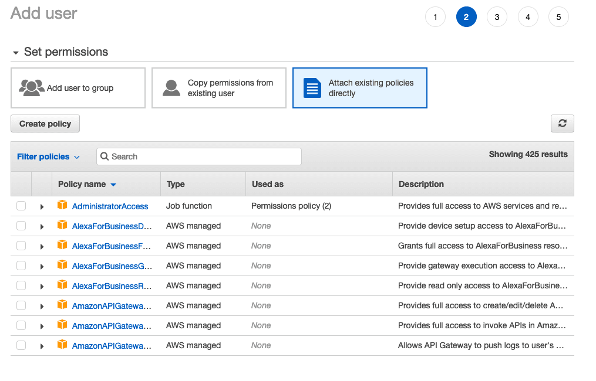

# Why you will want to upload files to a private S3 directly from the browser?

Well if your application is uploading a file to your server, and then your server uploads it to an S3 Bucket, you have a bottleneck and performance trouble.

My clients were uploading **large** video **files**, 100mb average, from various locations Asia, Europe, and North America, my server is hosted on **Heroku** and located in **Northen Virginia** **but my main S3 Bucket** is on **Frankfurt**!

Will be easier and efficient if the web client has the possibility to upload directly to that S3 Bucket.


Seem's trivial but you may confront several problems and the official AWS documentation don't tell you much.

# The procedure

You will need to generate `pre-signed` S3 URLs, so a user can write an object **directly** with a **POST** or **PUT** call.

A `pre-signed` URL is a URL that you generate with your AWS credentials and you provide to your users to grant temporary access to a specific S3 object. 

# Generate Credentials

## Open you AWS Console and Navigate to IAM


## Create a User with Programmatic access


## Click the attach existing policies directly tab


## Click create your own policy and copy the following

```JSON
{
    "Version": "2012-10-17",
    "Statement": [
        {
            "Effect": "Allow",
            "Action": [
                "s3:Put*"
            ],
            "Resource": [
                "arn:aws:s3:::your-bucket-name/*",
            ]
        }
    ]
}
```


Click Review Policy and enter a name for the policy. Save the policy
Add it to your new user.

# Configuring S3 CORS policy

1- Go to your bucket

2- Go to the permissions tab

3- Click CORS configuration and copy and paste the following


```xml
<?xml version="1.0" encoding="UTF-8"?>
<CORSConfiguration xmlns="http://s3.amazonaws.com/doc/2006-03-01/">
<CORSRule>
    <AllowedOrigin>*</AllowedOrigin>
    <AllowedMethod>HEAD</AllowedMethod>
    <AllowedMethod>GET</AllowedMethod>
    <AllowedMethod>PUT</AllowedMethod>
    <AllowedMethod>POST</AllowedMethod>
    <AllowedHeader>*</AllowedHeader>
</CORSRule>
</CORSConfiguration>
```

# Activating Transfer Acceleration Endpoint

Amazon S3 Transfer Acceleration is a bucket-level feature that enables faster data transfers to and from Amazon S3.

1- Go to your bucket

2- Choose properties
  
3- Click on permissions
  
4- Scroll to transfer acceleration and active it
  

# Server Code - PUT to a transfer acceleration endpoint

You have two choices for generating the pre-signed URL, depending on how your client code will upload the file.

This approach generates a PUT endpoint but you **can-not** use multi-part FormData to upload files. But you can benefit from using AWS Transfer acceleration endpoint
We rely on the `getSignedUrl` method from AWS-SDK.
https://docs.aws.amazon.com/AWSJavaScriptSDK/latest/AWS/S3.html#getSignedUrl-property

```javascript
const AWS = require('aws-sdk');
const express = require('express');
const route = express.Router();

route.get('/signed-url-put-object', async (req, res) => {
  AWS.config.update({
    accessKeyId: 'AAAAAAAAAAAAAAAA', // Generated on step 1
    secretAccessKey: 'J21//xxxxxxxxxxx', // Generated on step 1
    region: 'eu-west-1', // Must be the same as your bucket
    signatureVersion: 'v4',
  });
  const params = {
    Bucket: 'your-bucket-name',
    Key: 'my-awesome-object.webm',
    Expires: 30 * 60, // 30 minutes
    ContentType: 'video/webm'
  };
  const options = {
    signatureVersion: 'v4',
    region: 'eu-west-1', // same as your bucket
    endpoint: new AWS.Endpoint('your-bucket-name.s3-accelerate.amazonaws.com'),
    useAccelerateEndpoint: true,
  }
  const client = new AWS.S3(options);
  const signedURL = await (new Promise((resolve, reject) => {
    client.getSignedUrl('putObject', params, (err, data) => {
      if (err) {
        reject(err)
      } else {
        resolve(data)
      }
      });
  }));
  return res.json({
    signedURL,
  })
}
```

# Server Code - POST Multi-Part FormData

With this, you will generate a FORM and you must send all the fields in a FormData object in a **POST** request to the S3 bucket.

**You can not use the transfer acceleration endpoint because is a CloudFront endpoint that it's not configured with the necessary CORS options and you cannot change it sadly.**

But this is useful if you are developing a react native application and you have the needing of using a FormData or any other scenario where you must use multi-part uploads.

For this method we rely on the `createPresignedPost` method from AWS-SDK please note the difference with the previous method.
https://docs.aws.amazon.com/AWSJavaScriptSDK/latest/AWS/S3.html#createPresignedPost-property

*You cannot use transfer acceleration with this method*

```javascript
const AWS = require('aws-sdk');
const express = require('express');
const route = express.Router();

route.get('/signed-form-upload', async (req, res) => {
  AWS.config.update({
    accessKeyId: 'AAAAAAAAAAAAAAAA', // Generated on step 1
    secretAccessKey: 'J21//xxxxxxxxxxx', // Generated on step 1
    region: 'eu-west-1', // Must be the same as your bucket
    signatureVersion: 'v4',
  });
  const params = {
    Bucket: 'your-bucket-name',
    Key: 'my-awesome-object.webm',
    Fields: {
      Key: 'my-awesome-object.webm',
    },
  };
  const options = {
    signatureVersion: 'v4',
    region: 'eu-west-1', // same as your bucket
    endpoint = new AWS.Endpoint('https://your-bucket-name.s3.amazonaws.com'),
    useAccelerateEndpoint = false,
    s3ForcePathStyle = true,
  }

  const client = new AWS.S3(options);
  const form = await (new Promise((resolve, reject) => {
    client.createPresignedPost(params, (err, data) => {
      if (err) {
        reject(err)
      } else {
        resolve(data)
      }
    });
  }));
  return res.json({
    form: { ...form, url: config.aws.s3.AWS_S3_ENDPOINT } 
  })
}
```


# Conclusion

There are several ways to upload files to a private S3 bucket directly from browser, and can be challenging and confusing, but with a little effort, you will have a huge improvement in your performance.

# Resources

- https://www.digitalocean.com/community/questions/signed-put-url-for-nodejs

- https://sanderknape.com/2017/08/using-pre-signed-urls-upload-file-private-s3-bucket/

- https://docs.aws.amazon.com/AmazonS3/latest/API/sigv4-UsingHTTPPOST.html

- https://docs.aws.amazon.com/AWSJavaScriptSDK/latest/AWS/S3.html

- https://docs.aws.amazon.com/AmazonS3/latest/user-guide/enable-transfer-acceleration.html