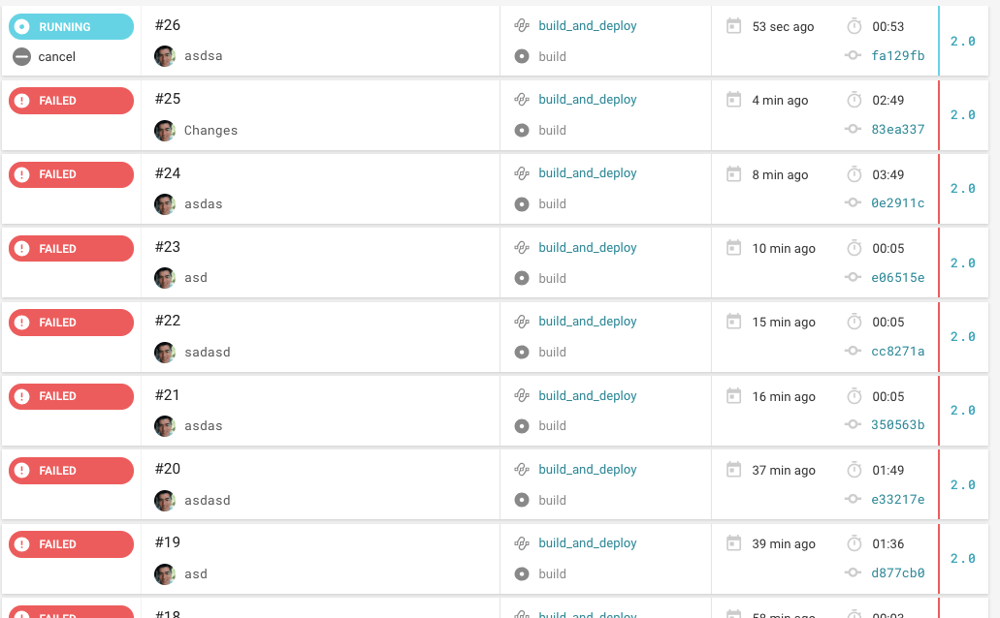

# Do you struggle to generate APK for your Ionic App?

  I use to work for a company where we have a hybrid mobile app, we made it with Ionic Framework (version 2).

  The problem was only one developer and one computer could generate the APK, this was a bottleneck especially when we were in a rush to complete the sprint and the QA Team needed several APK. 

  You know how is this, maybe the change requested by the QA team was only a change of text but we had to wait for that developer to be free to generate an APK.

# It's hard to setup your computer for this task

  As you may experience, making an APK on your machine can be difficult, you need to install Android Studio or at least Android SDK Manager, spend some time downloading the 20GB SDKs, fighting with your almost completed MBP's SSD because of videos from your last holiday.

  Even if you can handle all that trouble, maybe your coworkers don't, and you will become that guy who can generate the APK, they always will depend upon you or your computer.

# Introducing automated APK generation with CircleCI and Docker

  Here come continuous delivery practices to solve your problems. With the help of my friend CircleCI and the amazing Docker technology, you can pass the responsibility to them and forget about manually generating ionic mobile app APKs for the QA team.
  Now even you can run your automation testing suit.

  With CircleCI you have: 

   - No more buggy ionic mobile app APKs, run automation testing and then generate APK

   - Save ~10 minutes from every ionic mobile app APK generation.

   - Independence, no more sharing a file through airdrop, just use the download link from CircleCi dashboard.

   - Totally free
 
  It took me several attempts...

  

  But here I have a the CircleCi `config.yml` ready for you, so don't have to fight with the Java, Gradle and Android Studio problems.

  `gist:santiq/8bf594ec29b78a615e424fdff178292f`

  Now the job will generate an APK and save it to the CircleCI Artifacts location, _at the time of writing you can save up to `3GB`._
  
  

# Conclusion

  The power of continuous integration and continuous delivery tools like CircleCI and Docker can help you save tons of time, therefore tons of money.
  
  You can go further and optimize the CircleCI configuration to make use of the cache layer.

  Even you can set up Google Drive (or Dropbox or an FTP) integration so the QA Team doesn't have to enter to CircleCI to download the file.

  In a future post, we will discuss how to use CircleCI to automate API Testing before your server goes to production, this will give you peace of mind, believe me.

# Resources

 - https://discuss.circleci.com/t/where-is-the-android-sdk/14517
 - https://stackoverflow.com/questions/43356833/cordova-android-requirements-failed-could-not-find-an-installed-version-of-gra/52586052
 - https://ionicframework.com/docs/installation/android
 - https://linuxize.com/post/how-to-install-gradle-on-ubuntu-18-04/
 - https://circleci.com/docs/2.0/artifacts/